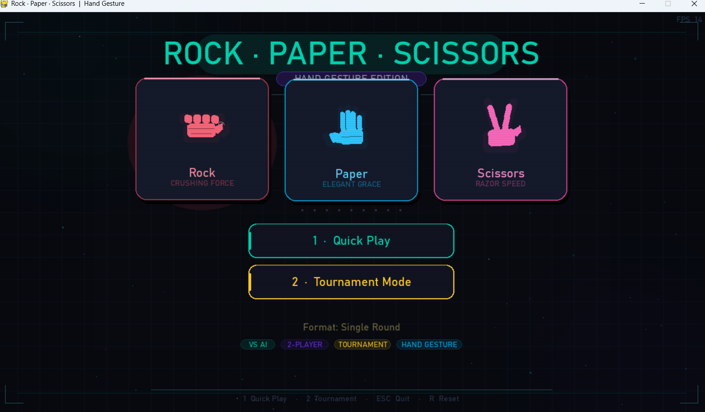
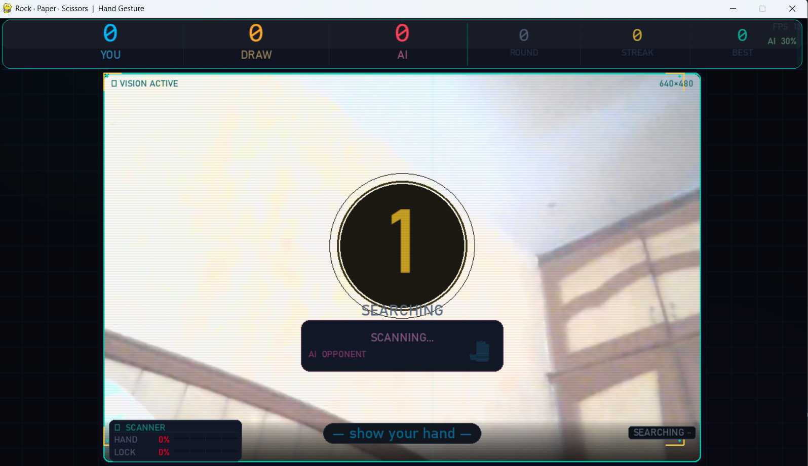
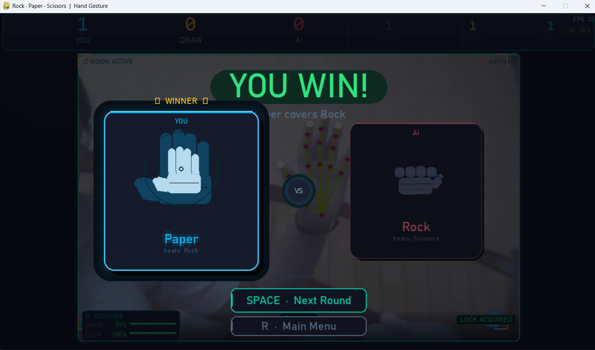

<div align="center">

<br/>

**A real-time hand gesture game powered by computer vision.**  
Show your hand to the webcam. The AI sees it. You play.

<br/>

[](https://python.org)
[](https://opencv.org)
[](https://ai.google.dev/edge/mediapipe)
[](https://pygame.org)

<br/>



</div>

---

## What is this?

A fully playable Rock Paper Scissors game where MediaPipe tracks your hand landmarks in real time, classifies your gesture each frame, and determines the winner against an adaptive AI or a second local player. Runs at 60 FPS with animated gesture reveals, a particle system, tournament mode, and synthesised audio — all in a single Python file.

---

## Assets/Screenshots

| Gameplay | Result |
|:---:|:---:|
|  |  |

*Left: countdown with live webcam feed, scanner HUD, and AI difficulty panel. Right: winner card with glow aura and hand skeleton visible in background.*

---

## Features

**Hand Tracking & Gesture Recognition**
- MediaPipe tracks 21 hand landmarks per frame in real time
- 14-frame voting buffer with 8-vote minimum — a single bad frame never misfires
- Asymmetric EMA confidence meter — rises fast on good detection, decays smoothly
- Dual-hand support for local 2-player with smart slot assignment (hands don't swap sides)
- Live status: `SEARCHING` → `HAND DETECTED` → `LOCKING TARGET` → `LOCK ACQUIRED`

**Adaptive AI Opponent**
- Starts at 70% random so new players feel competitive immediately
- Analyzes your last 8 moves and counters your most-played gesture
- Randomness drops 5% per win, floors at 10% — never fully solvable
- Current AI adaptation level shown live on the scoreboard

**Tournament System**
- Five formats: Single Round, Best of 3, Best of 5, Best of 7, Championship (Best of 11)
- Visual pip tracker shows round-by-round progress
- Ends early as soon as the winner is decided — no padding

**Visual Polish**
- Per-gesture idle animations: Rock slams with shockwaves, Paper floats in a figure-8, Scissors snaps with slash trails
- Entrance reveals: Rock bounce-drops, Paper springs with elastic easing, Scissors slashes in from the side
- Particle burst system, screen flash, winner glow aura, scan-beam on scoreboard
- All gesture icons vector-drawn with Pygame primitives — no image files

**Audio**
- All sound effects synthesised with NumPy at startup — no audio files bundled
- Harmonic synthesis for richer tones on key events (win, reveal, champion)

---

## Installation

```bash
git clone https://github.com/GurmannatK/CV-Rock.Paper.Scissors.git
cd CV-Rock.Paper.Scissors
pip install -r requirements.txt
python rock_paper_scissorsVF.py
```

> On first launch, the MediaPipe hand landmarker model (~29 MB) downloads automatically and caches as `hand_landmarker.task` next to the script.

**Python 3.9+ and a working webcam required.**

---

## Requirements

| Package | Purpose |
|---|---|
| `opencv-python` | Webcam capture and frame processing |
| `mediapipe` | 21-point hand landmark detection |
| `numpy` | Frame buffer manipulation and audio synthesis |
| `pygame` | 60 FPS rendering, input handling, audio playback |

---

## Controls

| Key | Action |
|---|---|
| `1` | Quick Play / VS AI |
| `2` | Tournament Mode |
| `SPACE` | Next round |
| `R` | Return to main menu |
| `ESC` | Back / Quit |

No key needed to make your move — hold your gesture in frame and wait for **LOCK ACQUIRED**.

---

## How It Works

### Gesture Detection

Each frame goes through: **capture → landmark detection → extension check → classification → vote buffer → EMA smoothing.**

Finger extension is determined geometrically — tip Y vs PIP joint Y for fingers 2–5, and X displacement for the thumb. A gesture is only confirmed when one label holds **8+ votes in a 14-frame window**, making detection stable even with hand wobble.

Rock is disambiguated by checking if any extended finger's tip falls within `2× palm radius` of the wrist — partially curled fingers don't misfire as Scissors.

### Adaptive AI

```python
if random.random() < rand_prob:
    return random.choice(GESTURE_LIST)           # random
else:
    likely = Counter(history[-8:]).most_common(1)[0][0]
    return gesture_that_beats(likely)            # counter
```

Starts at `rand_prob = 0.70`. Every player win drops it by `0.05`, floor of `0.10`.

### No ML Classifier

Gesture classification is pure geometric rule-based logic — fast, interpretable, and hardware-agnostic. No model training required.

---

## Project Structure

```
CV-Rock.Paper.Scissors/
├── rock_paper_scissorsVF.py    ← entire codebase (~2800 lines)
├── requirements.txt
├── README.md
├── .gitignore
├── assets/
│   ├── menu.png
│   ├── gameplay.png
│   └── results.png
└── docs/
    └── architecture.md         ← full subsystem breakdown
```

---

## Author

Built by **Gurmannat Kaur** 

- LinkedIn: [Gurmannat Kaur](https://www.linkedin.com/in/gurmannat-kaur-730841282)
